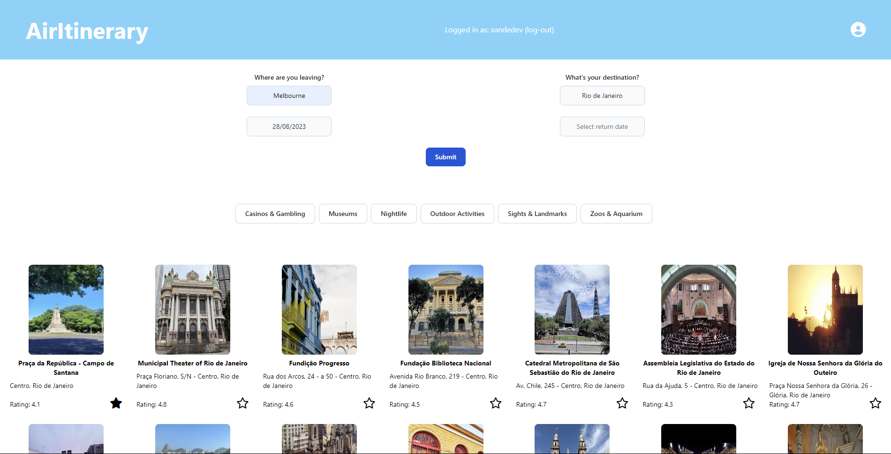

# Dunder Nifflin CMS



## Description
This project was the week 13/module 12 challenge focusing on using MySQL in conjunction with node.js.  The challenge was to create a CMS (Content Management System). I found this challenge the most challenging for quite a while; mostly because there's a few different syntaxes in play, trying to understand the capabilities of MySQL but also trying to connect it with node.js at the same time.  I had it mostly ready by the due date, but asked for a 3 day extension so I could work on refactoring my code a bit, and write a decent readme.  If you delve into my code, you will see I've written code in JS that a SQL query can do for you with a simple statement, but I was unaware at the time, and have only found this at the end.  For example:  It took me a bit of tinkering to understand how to use a self-join to show the "manager" in the "View Employee Register" table, and soon after that I realised I could have solved a lot of JS problems with some simple MySQL!

In the end I was really proud of how I set up my HTTP request routes, I feel I kept it really clean by modulating the files and keeping the functions in a separate file.  I also think I could have cleaned up the inquirer code in my index.js, and used more functions to make the fetch requests, at this stage I just don't have the time to continue refactoring code which kills me on the inside a little... I guess this would be a real challenge in a commercial setting with deadlines!

In this challenge there were a few bonus items that could be completed; I incorporated two of them into my application (Update employee managers, View employees by manager), and the others I wrote the queries in /db/query.sql to prove to myself that I could actually do them.  I have full confidence that I have the ability to incorporate them into this application.

The acceptance criteria of this project were as follows:

```md

```

## Table of Contents

1. [Application Walkthrough](#application-walkthrough)
2. [Usage](#usage)
3. [License](#license)
4. [Contribution](#contribution)
5. [Questions](#questions)

## Deployed Application
The deployed application can be viewed from the following link: <https://samsung-universe-001f412ec000.herokuapp.com/>.

## Usage


## License
<br>
This project is covered under the MIT License.

## Contribution
sleepyhaha: <https://github.com/sleepyhaha>
p-h-davies: <https://github.com/p-h-davies>
x4ndez: <https://github.com/x4ndez>

## Questions
<!-- Questions may be directed to my LinkedIn: <https://www.linkedin.com/in/alexandernanfro/>. -->